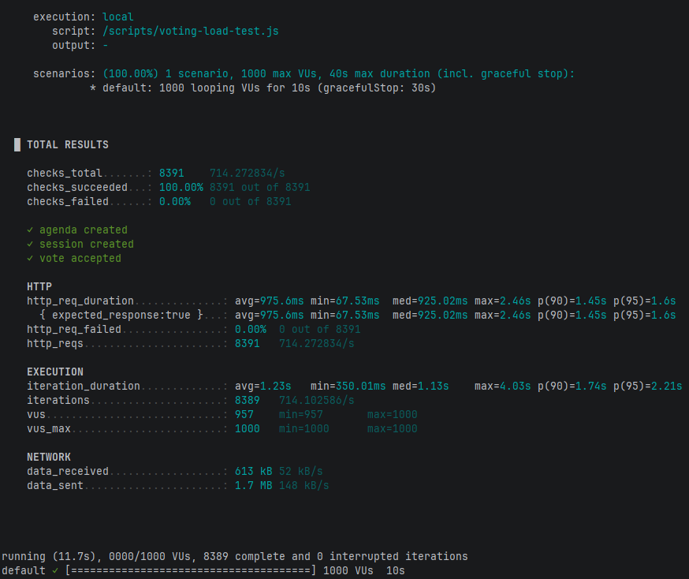
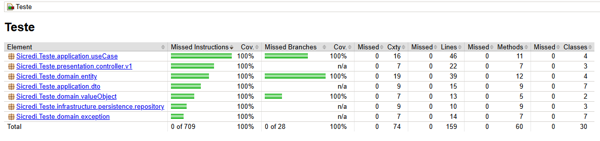

# Voting API

API de votação de pautas em **Spring Boot**, seguindo Clean Architecture. Permite criar pautas, abrir sessões, receber votos e obter resultados.

## Tecnologias
- Java 17 / Spring Boot 4
- PostgreSQL 16
- Spring Data JPA / Hibernate
- Docker / Docker Compose
- k6 para testes de performance
- JUnit 5 para testes unitários e integrados

## Rodando com Docker Localmente
 - docker-compose up --build

API disponível em `http://localhost:8080/api/v1`

## Swagger
- Disponivel em `http://localhost:8080/swagger-ui/index.html#/`

## Ambiente Cloud
- Demora alguns minutos para a aplicação subir pois ela desliga após 15 minutos inativa
- Disponivel em `https://sicredi-teste.onrender.com/swagger-ui/index.html#/`

## Endpoints
- **Criar Agenda**: `POST /api/v1/agendas`  
  Payload: `{ "title": "Título", "description": "Descrição" }`  
  Response: `201 Created` com id, title e description.

- **Abrir Sessão**: `POST /api/v1/voting-sessions`  
  Payload: `{ "agenda_id": 1, "end_time": "2026-03-16T10:30:00" }`  
  `end_time` opcional, default 1 minuto. Response: `201 Created`.

- **Votar**: `POST /api/v1/votes`  
  Payload: `{ "voting_session_id": 1, "associate_id": "12345678901", "vote_type": "Sim" }`  
  Cada associado só pode votar uma vez. Response: `200 OK`.

- **Resultado da Pauta**: `GET /api/v1/agendas/{agendaId}/result`  
  Response: `{ "agenda_id": 1, "yes_votes": 10, "no_votes": 3, "result": "Aprovado" }`

## Testes
- Executar com ./gradlew test
- **Unitários**: Testam useCases isolados
- **Domain**: Testam entidades e value objects
- **Integrados**: Testam use cases com banco via Testcontainers
- **E2E**: Testam chamado da controller com banco via Testcontainers
- **Performance**: Script k6 para simular votos simultâneos

## K6
- **Pode ser executado com**: docker-compose run k6

## Ambiente do Teste de Performance

- Sistema Operacional: Windows 10 Home 64-bit
- Processador: AMD64 Family 23 Model 113 ~3.6 GHz
- Memória RAM: 16 GB
- Containers Docker: voting-api + voting-postgres
- Teste executado com k6 1000 VUs, 10s

## Analise qualidade

## Pré-requisitos

Para rodar a aplicação você precisa ter instalado:

- Java 17
- Docker

## Observações
- `associate_id` deve ser um CPF válido (11 dígitos numéricos)
